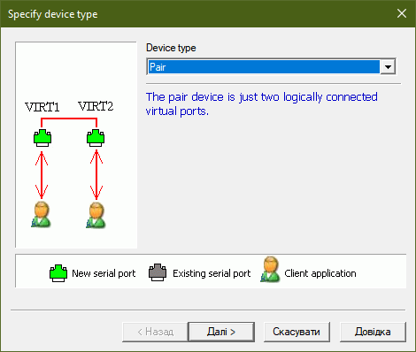

<h1 align="center">RS-232C interface simulator</h1>
<h2>What is it?</h2>

This is a simple program created using the C++ programming language and the Qt graphics library. 
It simulates the operation of the RS-232C interface, namely the codes of the message characters in the ASCII.

<h2>How does it work?</h2>

First, you need to install <a href="https://eterlogic.com/Products.VSPE.html">VSPE</a>, and repeat the steps you see in the images below. 
This is to simulate the operation of the COM ports between which data will be transferred.

    <ol>
        <li></li>
        <li></li>
        <li></li>
        <li></li>
    </ol> 

Now that you have virtual COM ports, run the program twice. Now you have two identical windows. In each of them, you need to specify in the "Data bits" field the number of bits of one character 
(recommended 8, according to ASCII). Next, specify the number of stop bits (1 or 2). And also the word delay. Next, select which COM port each window will be. Now activate these windows. 
Each window can be either a transmitter or a receiver. Now you can exchange messages between the windows and observe how the message transmission process takes place using the RS-232C interface.

<h2>What does it look like?</h2>

<h2>Additional sources</h2>

    <ul>
        <li><a href="https://en.wikipedia.org/wiki/ASCII">ASCII</a>;</li>
        <li><a href="https://en.wikipedia.org/wiki/RS-232">RS-232</a>.</li>
    </ul> 

